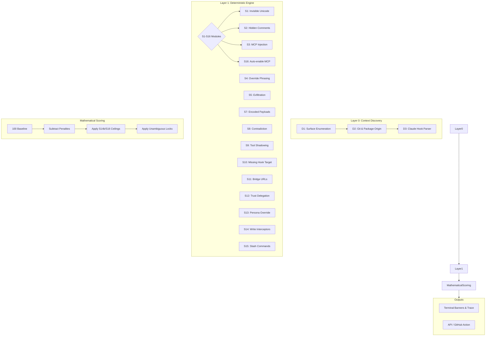

# SENTINEL ARCHITECTURE

Sentinel is designed as a deterministic, multi-layer security pipeline.

### Architectural Constraints
1. **No ML in Layer 1:** Layer 1 is intentionally deterministic. Predictability is a feature, not a bug, ensuring the system can be rigorously audited and bypassed predictably by Layer 3 when needed.
2. **Decoupled Scoring:** Scoring arithmetic exists entirely independent of rule detection logic (`sentinel/scoring/formula.py`), ensuring that finding extraction never mutates final verdicts prematurely.
3. **Additive APIs:** The `ScanResult` JSON schema is purely additive, ensuring VS Code, GitHub Actions, and React frontends consume a stable contract.
